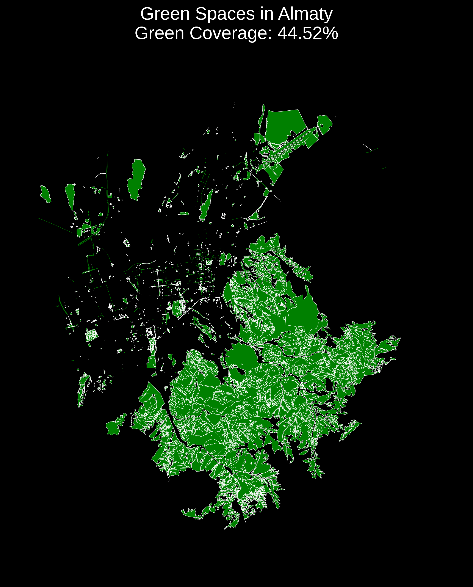

# Almaty-Green-Spaces

I visualized the green spaces of the city of Almaty using Python

I developed this visualization using Python, using the osmnx (OpenStreetMap) and matplotlib (visualization) libraries

The visualization shows all the green spaces of the city of Almaty 🌳

I also calculated the percentage of green spaces from the total area of the city

44.52% is due to the fact that the territory of the city includes part of the foothills

Such maps help urban planners, environmentalists and researchers better understand the distribution of green areas, plan new green spaces and improve the quality of life of citizens. In addition, they promote scientific research and help create more sustainable and healthy urban environments.
